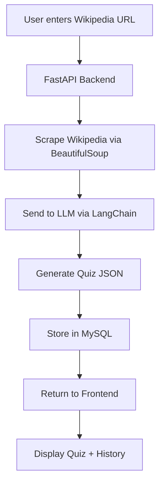

# 🧠 Quizipedia – AI Wiki Quiz Generator

Transform any **Wikipedia article** into an **AI-generated quiz** instantly. Enter a Wikipedia URL → content is scraped, analyzed by an LLM, and turned into a structured quiz with questions, answers, and insights.

---

## 🚀 Overview

**Quizipedia** is a full-stack web app that blends AI and knowledge discovery.  
It takes a Wikipedia URL, scrapes the content using **BeautifulSoup**, processes it through an **LLM (via LangChain)**, and generates:
- A brief **summary**
- **Key people**, entities & topics
- **5 MCQs** with difficulty level, correct answer & explanation  
- **Related topics** for further learning

All quizzes are stored in a **MySQL** database and can be viewed later in the **History tab**.

---

## ⚙️ Tech Stack

### Frontend  
- **React.js** + **Vite** + **Tailwind CSS**  
- Responsive UI with Dark Mode  

### Backend  
- **FastAPI** (Python)  
- **BeautifulSoup4** for scraping  
- **LangChain + Gemini LLM** for AI quiz generation  
- **SQLAlchemy + MySQL** for data storage  

---

## 🔄 How It Works




## 🧩 Example Output by Backend

```json
{
  "title": "Artificial Intelligence",
  "summary": "AI is intelligence demonstrated by machines...",
  "key_entities": {
    "people": ["Alan Turing", "John McCarthy"],
    "organizations": ["DARPA"]
  },
  "quiz": [
    {
      "question": "Who is known as the father of AI?",
      "options": ["Turing", "McCarthy", "Minsky", "Shannon"],
      "answer": "John McCarthy",
      "difficulty": "medium",
      "explanation": "He coined the term 'Artificial Intelligence'."
    }
  ],
  "related_topics": ["Machine Learning", "Robotics"]
}
```

## 🖼️ Screenshots

- Generate Quiz


- Past Quizzes (History)


- Quiz Details


## 💬 Thank You

- Thank you for checking out Quizipedia — where Wikipedia meets AI to make learning fun and interactive.
- ⭐ Contributions, feedback, and ideas are always welcome!
